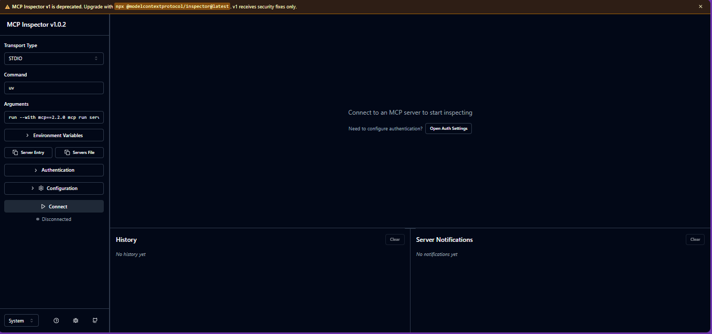
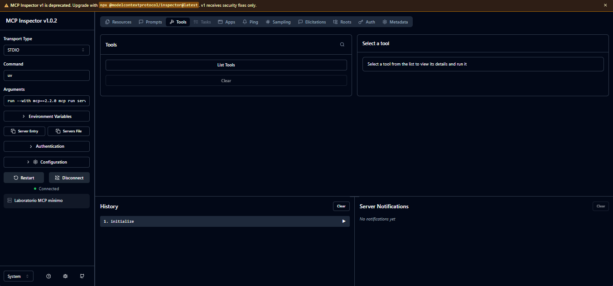
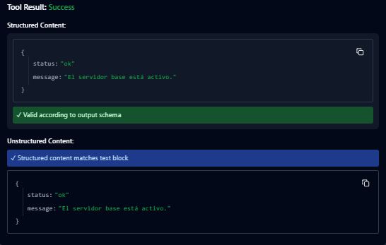
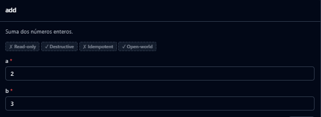
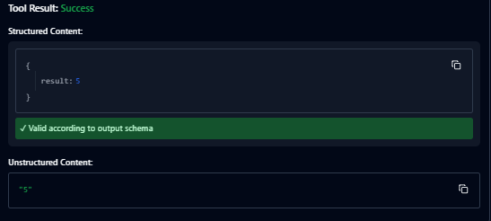

# 02 — Servidor mínimo e Inspector

## Propósito

Construir el servidor MCP más pequeño posible y probarlo con MCP Inspector. En esta etapa no se integra Django: así se separan protocolo, SDK y reglas de negocio.

## Requisitos

- Python y `uv` instalados.
- Un proyecto Python inicializado con `uv`.

## Actividad

1. El archivo `server.py` ya declara una tool `health` funcional y una tool
   `add` intencionalmente incompleta. Prepará el entorno:

   ```sh
   uv sync
   ```

2. Revisá el contrato de `add` y completá únicamente su cuerpo, sin cambiar su
   nombre, documentación ni tipos.
3. Iniciá el Inspector:

   ```sh
   uv run mcp dev server.py
   ```

4. En Inspector, verificá que ambas tools aparezcan en el catálogo y llamá a
   `add` con dos valores válidos y un caso inválido.

## Punto de control

- La tool se descubre sin escribir manualmente JSON Schema.
- Inspector muestra sus argumentos como enteros requeridos.
- `add(2, 3)` devuelve `5`.
- Un argumento inválido produce un error comprensible, no un traceback opaco.

## Entrega mínima

- `server.py` ejecutable con una tool pequeña, nombrada y documentada con claridad.
- Una captura o registro de una invocación exitosa en Inspector.
- Una frase que explique cómo las anotaciones de tipos forman parte del contrato visible para el host.

## Para pensar

- ¿Por qué Inspector es útil antes de probar con un agente?
- ¿Qué información debe tener una tool para que un modelo pueda usarla sin adivinar?

## Respuesta
```
El Inspector valida automáticamente en el frontend basándose en el JSON Schema generado por las anotaciones de tipo. Esto impide que se envíen valores inválidos al servidor, demostrando que el contrato de tipos se respeta en ambas capas (cliente y servidor). Para probar el manejo de errores del servidor, se requeriría al parecer un cliente que omita la validación o modificar temporalmente las anotaciones de tipo.
``` 

## Capturas
------------------------------
#### Sin conexión:

<p align="center">
 
</p>

### Conectado:

<p align="center">
 
</p>

### Mensajes

<p align="center">
 
</p>

<p align="center">
 
</p>

<p align="center">
 
</p>
