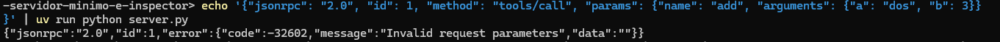

# 02 — Servidor mínimo e Inspector

## Propósito

Construir el servidor MCP más pequeño posible y probarlo con MCP Inspector. En esta etapa no se integra Django: así se separan protocolo, SDK y reglas de negocio.

## Requisitos

- Python y `uv` instalados.
- Un proyecto Python inicializado con `uv`.

## Actividad

1. El archivo `server.py` ya declara una tool `health` funcional y una tool
   `add` intencionalmente incompleta. Prepará el entorno:

   ```sh
   uv sync
   ```

2. Revisá el contrato de `add` y completá únicamente su cuerpo, sin cambiar su
   nombre, documentación ni tipos.
3. Iniciá el Inspector:

   ```sh
   uv run mcp dev server.py
   ```

4. En Inspector, verificá que ambas tools aparezcan en el catálogo y llamá a
   `add` con dos valores válidos y un caso inválido.

## Punto de control

- La tool se descubre sin escribir manualmente JSON Schema.
- Inspector muestra sus argumentos como enteros requeridos.
- `add(2, 3)` devuelve `5`.
- Un argumento inválido produce un error comprensible, no un traceback opaco.

## Entrega mínima

- `server.py` ejecutable con una tool pequeña, nombrada y documentada con claridad.
- Una captura o registro de una invocación exitosa en Inspector.
- Una frase que explique cómo las anotaciones de tipos forman parte del contrato visible para el host.

## Para pensar

- ¿Por qué Inspector es útil antes de probar con un agente?
- ¿Qué información debe tener una tool para que un modelo pueda usarla sin adivinar?

## Respuesta
```
- El Inspector permite validar el servidor MCP de forma aislada, verificando que las tools estén correctamente definidas, que el JSON Schema se genere automáticamente desde las anotaciones de tipo, y que los errores se manejen de forma estructurada. Esto evita que los problemas se mezclen con el comportamiento impredecible de un LLM (alucinaciones, reintentos automáticos, formateo incorrecto de argumentos), actuando como una capa de pruebas unitarias antes de integrar el agente.
- Por ende, se eliminó la validación manual isinstance porque el SDK de MCP ya valida los tipos automáticamente gracias a las anotaciones int. Esto hace el código más limpio y "pythonico" para MCP.
- Una tool debe tener: 
1. Un nombre claro y accionable que describa su función.
2. Una descripción que explique qué hace y cuándo debe usarse.
3. Anotaciones de tipo estrictas en los parámetros y el valor de retorno, que el SDK traduce a JSON Schema para que el modelo sepa exactamente qué formato de datos proporcionar.
4. Opcionalmente, descripciones explícitas en cada parámetro si el nombre por sí solo no es autoexplicativo. Con esta información, el modelo puede invocar la herramienta correctamente sin necesidad de 'adivinar' los tipos o el propósito

``` 

## Capturas
------------------------------
#### Sin conexión:

<p align="center">
 
</p>

### Conectado:

<p align="center">
 
</p>

### Mensajes

<p align="center">
 
</p>

<p align="center">
 
</p>

<p align="center">
 
</p>

<p align="center">
   
</p>
