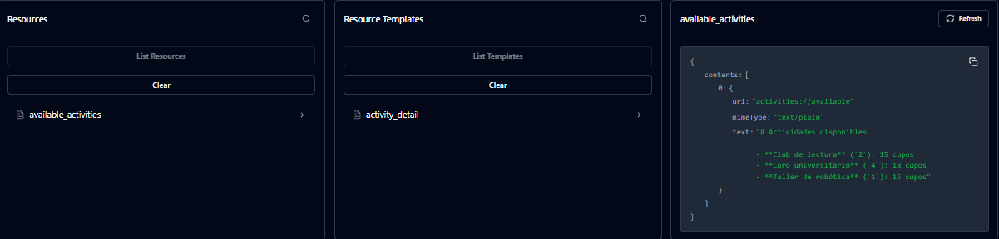
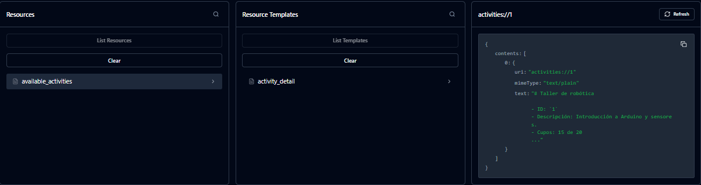
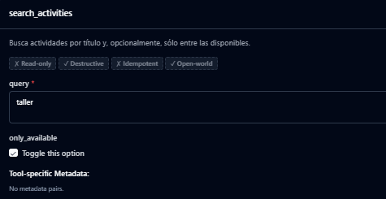
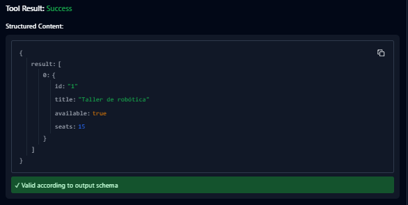
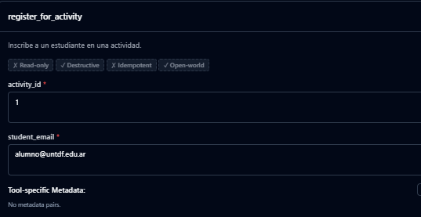
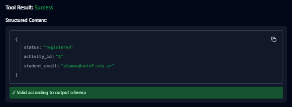
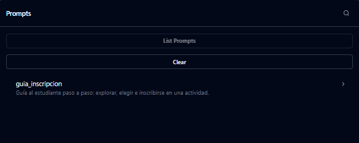
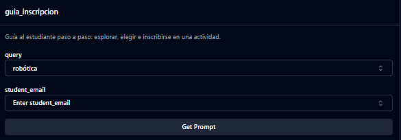
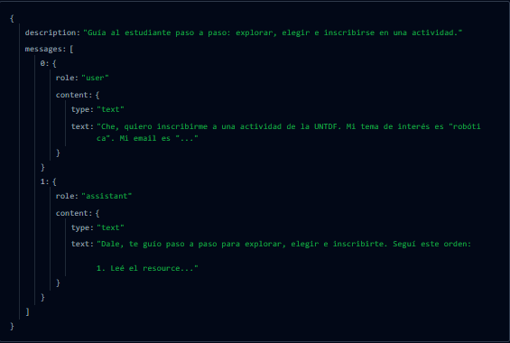
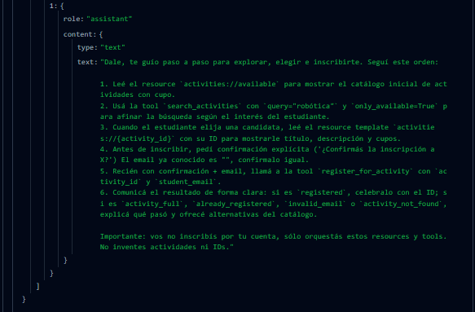

# 03 — Integración con Django

## Propósito

Agregar MCP como adaptador sobre la aplicación de actividades ya existente. La lógica del dominio debe seguir viviendo en el service layer: MCP y REST son interfaces distintas sobre las mismas reglas.

## Requisitos

- La etapa 02 completada.
- Python y `uv` instalados.

El proyecto Django de actividades **ya viene implementado** en esta carpeta
(`config/`, `manage.py`, `activities/` con modelos, service layer, views y
seed de ejemplo). No hay que modificarlo: es el dominio existente sobre el
que se monta el adaptador MCP. El trabajo de esta etapa está únicamente en
`mcp_server/`.

## Estructura sugerida

```text
03-integracion-con-django/
├── config/            # settings y urls del proyecto Django (dado)
├── manage.py          # gestión Django: migrate, seed_activities, shell
├── activities/        # app Django: models, services, views (dado)
└── mcp_server/        # adaptador MCP: TRABAJO DEL ALUMNO
    ├── server.py
    ├── tools.py
    ├── resources.py
    └── prompts.py
```

La estructura exacta puede variar. El criterio importante es que el servidor MCP delegue en servicios existentes y no copie queries o reglas de negocio.

## Backend Django (dado, no modificar)

El dominio ya funciona. Para prepararlo:

```sh
uv sync
uv run python manage.py migrate
uv run python manage.py seed_activities
```

Correr el server:

```sh
uv run python manage.py runserver
```

La API REST (`/api/activities/`, detalle, `search/` y `register/`) usa el
mismo `ActivityService` que debe usar el adaptador MCP.

## Endpoints REST disponibles (backend dado, no modificar)

Base: `http://127.0.0.1:8000/api/` (con `uv run python manage.py runserver`).
Montadas en `config/urls.py` → `activities/urls.py`, implementadas en
`activities/views.py` sobre `ActivityService` (`activities/services.py`).
Serialización en `activities/serializers.py`.

Objeto `activity`:

```json
{
  "id": "1",
  "title": "Taller de robótica",
  "description": "Introducción a Arduino.",
  "available": true,
  "seats": 12,
  "capacity": 20
}
```

| Método | Ruta | Descripción |
| ------ | ---- | ----------- |
| `GET` | `/api/activities/` | Catálogo de actividades disponibles (con cupo y activas). |
| `GET` | `/api/activities/<activity_id>/` | Detalle de una actividad por ID. |
| `GET` | `/api/activities/search/?query=...[&only_available=false]` | Búsqueda por título, con filtro opcional de disponibilidad. |
| `POST` | `/api/activities/<activity_id>/register/` | Inscribe un estudiante en una actividad. |

### `GET /api/activities/` — catálogo

Sin parámetros. Responde `200` con un array (vacío si no hay disponibles).

```sh
curl http://127.0.0.1:8000/api/activities/
```

```json
[{"id": "1", "title": "Taller de robótica", "description": "...", "available": true, "seats": 12, "capacity": 20}]
```

Fuente: `ActivityService.list_available()`.

### `GET /api/activities/<activity_id>/` — detalle

Ejemplo: `GET /api/activities/1/`.

- `200`: objeto `activity`.
- `404`: `{"error": "activity_not_found", "activity_id": "<id>"}` (ID inexistente o no numérico).

```sh
curl http://127.0.0.1:8000/api/activities/1/
```

Fuente: `ActivityService.get_activity(activity_id)`; lanza `ActivityNotFound`.

### `GET /api/activities/search/?query=...` — búsqueda

Query params:

- `query` (opcional, default `""`): subcadena de título, case-insensitive. Vacío = todo el catálogo.
- `only_available` (opcional, default `"true"`): sólo `false` (exacto, case-insensitive) desactiva el filtro; cualquier otro valor filtra por disponibles.

Responde `200` con un array.

```sh
curl "http://127.0.0.1:8000/api/activities/search/?query=robotica"
curl "http://127.0.0.1:8000/api/activities/search/?query=&only_available=false"
```

Fuente: `ActivityService.search(query, only_available)`.

### `POST /api/activities/<activity_id>/register/` — inscripción

Body JSON: `{"student_email": "alumno@untdf.edu.ar"}`. El email se normaliza (trim + minúsculas) y se valida.

```sh
curl -X POST http://127.0.0.1:8000/api/activities/1/register/ \
  -H "Content-Type: application/json" \
  -d '{"student_email": "alumno@untdf.edu.ar"}'
```

Respuestas:

- `201`: `{"status": "registered", "activity_id": "1", "student_email": "alumno@untdf.edu.ar"}`
- `400` `{"error": "invalid_json"}`: body no es JSON válido.
- `400` `{"error": "invalid_email", "message": "..."}`: email inválido.
- `404` `{"error": "activity_not_found", "activity_id": "<id>"}`: actividad inexistente.
- `409` `{"error": "activity_full", "message": "..."}`: sin cupos.
- `409` `{"error": "already_registered", "message": "..."}`: email ya inscripto en esa actividad.

Fuente: `ActivityService.register(activity_id, student_email)`; usa transacción + `select_for_update`, restricción única `(activity, student_email)`.

## Actividad

El esqueleto incluye `server.py`, `mcp_server/` y el backend Django ya
conectable vía `ActivityService`. Prepará sus dependencias con `uv sync`,
prepará la base con `uv run python manage.py migrate` y
`uv run python manage.py seed_activities`, y abrí Inspector desde esta
carpeta:

```sh
uv run mcp dev server.py
```

El catálogo y la búsqueda responden vacíos hasta conectar el service layer. La
inscripción responde `not_implemented` a propósito. El prompt devuelve un
marcador `TODO(alumno)` hasta implementarlo. Implementá las capacidades
en este orden (sólo en `mcp_server/`, sin tocar `activities/` ni `config/`):

1. Resource `activities://available` para el catálogo de actividades disponibles.
2. Resource template `activities://{activity_id}` para el detalle de una actividad.
3. Tool `search_activities(query, only_available=True)` para una búsqueda por criterios variables.
4. Tool `register_for_activity(activity_id, student_email)` para la acción de inscripción.
5. Prompt `guia_inscripcion(query="", student_email="")` para el flujo guiado completo: explorar catálogo → buscar → ver detalle → pedir confirmación y email → inscribir. El prompt no inscribe por sí mismo: devuelve mensajes que orquestan los resources y tools anteriores.

Probá cada capacidad con MCP Inspector antes de pasar a la siguiente. Al
integrarlo con el proyecto real, configurá Django antes de importar modelos u
objetos que dependan del ORM.

## Criterios de diseño

- Catálogo y detalle son contexto legible: corresponden a resources.
- La búsqueda depende de criterios que el modelo puede decidir: corresponde a una tool.
- La inscripción cambia el estado: es una tool con efectos secundarios y requiere una autorización explícita.
- El flujo guiado es reutilizable y orquesta las capacidades anteriores sin lógica de negocio propia: corresponde a un prompt (no llama al service layer, devuelve mensajes que indican qué resource leer y qué tool ejecutar en cada paso).
- Las respuestas deben tener datos útiles para que el host pueda continuar el flujo.

## Punto de control

- El catálogo se lee mediante su URI.
- El template devuelve el detalle correcto y maneja un identificador inexistente.
- La búsqueda no expone SQL, ORM ni views como parte de su contrato.
- Una inscripción usa el mismo servicio de dominio que usaría una vista REST.
- El prompt `guia_inscripcion` se lista en Inspector, acepta `query` y `student_email` (ambos opcionales), nombra los resources/tools en orden y pide confirmación antes de inscribir.

## Entrega mínima

Un servidor MCP conectado a Django con las cinco capacidades (dos resources, dos tools, un prompt), una explicación de por qué cada una es resource, tool o prompt, y una demostración en Inspector de al menos catálogo, búsqueda, inscripción y el prompt guiado.

## Justificación de diseño
  - `activities://available` y `activities://{id}` (Resources): Se implementaron como Resources porque representan contexto legible (datos). El LLM los consulta para obtener información del estado actual del sistema sin modificarlo, similar a leer un archivo o una URL.

  - `search_activities` y `register_for_activity` (Tools): Se implementaron como Tools porque representan acciones. La búsqueda requiere parámetros dinámicos que el LLM decide en tiempo de ejecución, y la inscripción es una operación con efectos secundarios (cambia la base de datos) que requiere una invocación explícita y validación de parámetros.
  - `guia_inscripcion` (Prompt): Se implementó como Prompt porque no ejecuta lógica de negocio ni llama al servicio directamente. Su función es orquestar: devuelve un conjunto de mensajes predefinidos que le enseñan al LLM el orden correcto de usar los Resources y Tools anteriores (leer catálogo → buscar → ver detalle → pedir confirmación → inscribir), garantizando un flujo de usuario seguro y controlado.

## Capturas de las etapas

A continuación, algunas capturas del funcionamiento del servidor MCP con Django y el flujo guiado de inscripción:

### catalogo

<p align="center">
  
</p>

### detalle de actividad

<p align="center">
  
</p>

### buscar actividad

<p align="center">
  
</p>

### resultado de la busquedad

<p align="center">
  
</p>

## registro de la actividad

<p align="center">
  
</p>

### resultado del registro 

<p align="center">
  
</p>

### flujo guiado

<p align="center">
  
</p>

<p align="center">
  
</p>

<p align="center">
  
</p>

<p align="center">
  
</p>


