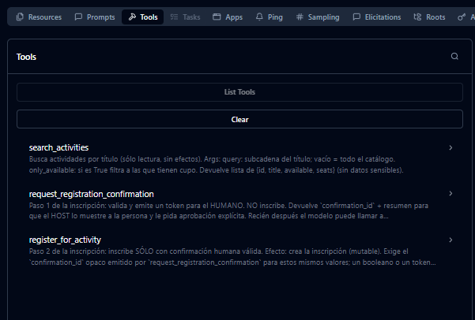
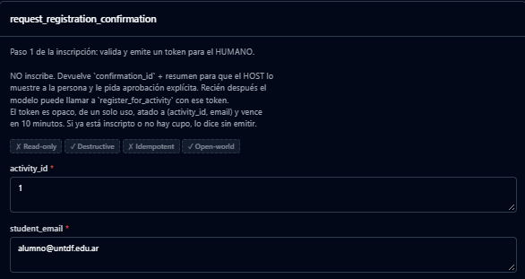
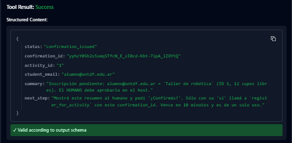
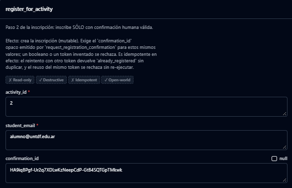
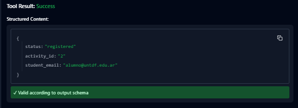
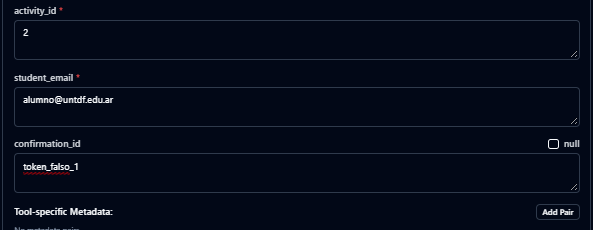
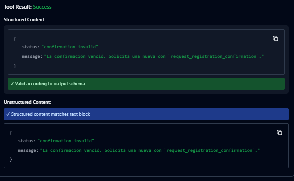

# 04 — Seguridad y cierre

## Propósito

Revisar la integración como una interfaz que habilita acciones a través de un host agéntico. Una tool disponible no equivale a un permiso automático.

## Actividad

Esta carpeta contiene una base segura por defecto: el servidor valida entradas
y rechaza cualquier inscripción porque `is_host_confirmation_valid` siempre
devuelve `False`. Preparala y abrila con Inspector:

```sh
uv sync
uv run mcp dev server.py
```

Aplicá estas mejoras al servidor de la etapa 03:

1. Validá los argumentos de cada capacidad, especialmente `activity_id` y `student_email`.
2. Convertí errores de dominio en resultados accionables. Como mínimo, cubrí actividad inexistente, cupo agotado y correo inválido.
3. Para la inscripción, completá `is_host_confirmation_valid`: debe verificar
   una confirmación emitida por el host o su interfaz, no aceptar un booleano
   que el modelo pueda inventar. Definí además cómo se evita una doble
   inscripción y qué dato se audita.
4. Revisá cada resource: debe devolver sólo la información necesaria y no filtrar datos sensibles.
5. Conectá el servidor local por `stdio` desde el host y realizá una prueba de extremo a extremo.

Ejemplo conceptual de configuración local en OpenCode:

```json
{
  "$schema": "https://opencode.ai/config.json",
  "mcp": {
    "activities": {
      "type": "local",
      "command": ["uv", "run", "python", "mcp_server/server.py"],
      "enabled": true
    }
  }
}
```

## Lista de verificación

- [ ] Los nombres y descripciones de las tools dicen con precisión qué hacen y qué efecto tienen.
- [ ] Todas las entradas se validan antes de llegar al dominio.
- [ ] Los errores indican causa, campo o alternativa; no filtran trazas internas.
- [ ] Las acciones mutables requieren confirmación y son idempotentes o manejan repeticiones de forma explícita.
- [ ] Existe un registro auditable de quién solicitó una inscripción y cuándo.
- [ ] El servidor expone la mínima autoridad necesaria; no existe una tool genérica como `execute_sql(query)`.

## Cierre: explicación oral

Prepará una demo con el flujo completo: pedido de la persona → selección de tool por el modelo → permiso del host → `tools/call` → service layer de Django → resultado → respuesta final.

También deberías poder explicar por qué REST y MCP pueden convivir: REST atiende contratos orientados a clientes de software; MCP expone capacidades descubribles para un host agéntico. MCP no reemplaza automáticamente la API REST.

## Extensión opcional: HTTP remoto

Cuando el servidor deje de ser local, el transporte puede ser Streamable HTTP. Antes de publicarlo, definí autenticación, límites de tasa, logs y trazas. Este despliegue no forma parte del mínimo del laboratorio.


### Pasos de ejecución:

1. Levantar el servidor desde `04-seguridad-y-cierre`
```bash
1 uv sync
2 uv run mcp dev server.py
```

2. Probar el flujo de seguridad de 2 pasos (Human-in-the-loop)
El modelo no puede inscribir a nadie directamente, necesita un token que solo el servidor puede generar.
  **Paso A:** Pedir la confirmación.
      - Ve a la pestaña tools y ejecuta `request_registration_confirmation`:
    <p align="center">
      
    </p>
      - con los siguientes datos:
    <p align="center">
      
    </p>
      - Resultado:
    <p align="center">
     
    </p>
  **Paso B:** Ejecutar la inscripción con el token.
      - Ejecuta la tool `register for_activity` con:
    <p align="center">
     
    </p>    
      - resultado:
    <p align="center">
     
    </p>
  **Paso C:** Probar la seguridad
    - Vuelve a ejecutar `register_for_activity` con los mismos datos, pero inventa un `confirmation_id`.
    <p align="center">
     
    </p>
      - resultado: 
    <p align="center">
     
    </p>

*Nota: Si usas el token verdadero por 2da vez, también fallará, el token es de un solo uso.*

## Cierre
1. El Flujo de Inscripción Segura:
El usuario pide inscribirse. El LLM no llama directamente a la tool de escritura. Primero, invoca `request_registration_confirmation`. El servidor valida los datos en el borde, genera un token opaco de un solo uso (TTL 10 min) y lo devuelve. El Host (la interfaz) le muestra este resumen al humano y le pide aprobación explícita. Solo cuando el humano acepta, el LLM llama a `register_for_activity` pasando ese `confirmation_id` exacto. El servidor valida el token, lo consume (garantizando idempotencia) y ejecuta el dominio. Si el LLM intenta inventar un token o reusarlo, el servidor rechaza la operación con un error accionable, sin filtrar trazas internas."
2. Por qué REST y MCP conviven:
"No se reemplazan, se complementan. REST es para clientes de software tradicionales (frontend, mobile) que siguen contratos de API fijos y predecibles (JSON). MCP, en cambio, expone capacidades descubribles (Resources, Tools, Prompts) para un host agéntico. MCP delega la orquestación y la toma de decisiones al LLM, pero mantiene la seguridad y la validación estricta en el servidor, actuando como una capa de adaptación segura sobre el mismo dominio de negocio."
